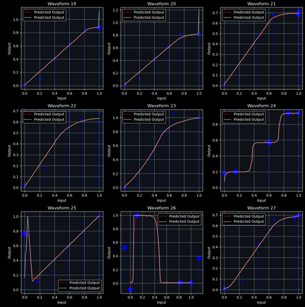

# WaveShaper DDSP

[**Code**](./code/Experiments_WaveShaper.ipynb)
| [**Tutorial**](#Tutorial)
| [**Presentation**](DDSP_Presentation.pptx)
| [**Original Papers**](https://arxiv.org/abs/2207.08759)

## Work Overview
As part of the class of G. Richard and R. Badeau, ["Audio Signal Analysis, Indexing, and Transformations"](https://www.master-mva.com/cours/audio-signal-analysis-indexing-and-transformations/), I studied the paper **[Style Transfer of Audio Effects with
Differentiable Signal Processing](https://arxiv.org/abs/2207.08759)** from Adobe Research and Queen Mary University.

The main contribution of this repository is the adaptation of the WaveShaper Plugin from FL-Studio into a PyTorch differentiable version with high expressivity. This plugin could be very useful in the style transfer of certain genres relying extensively on saturation and distortion of sounds.

## Deliverables

- A presentation with an explanation of the paper and results of experiments.
- Although not required, I provide the code for all my experiments.


# Wave Shaper
The WaveShaper is a plugin that applies a function $f: [-1,1] \rightarrow [-1,1]$ to all samples of an audio signal. This function is usually shaped by the user using curves and various interpolations. Here, we assume that $f$ is antisymmetric, so we model $f$ only on $[0,1]$.


I have also included all the images used for the generation of the *WaveShaper dataset*. This dataset includes all the FL Studio basic presets functions for the WaveShaper native plugin.


To my knowledge, the WaveShaper, while being simple, has never been modeled as a DDSP, due to its expressivity, which is theoretically infinite (one parameter for each value between -1 and 1). 
Here are four examples of possible uses of WaveShapers in a production pipeline:

- **Gain**: $f(x) = ax$
- **Bit Cruncher**: $f(x) = \left\lfloor \frac{|ax|}{a} \right\rfloor$
- **Saturation**: $f(x) = \max(x, a)$
- **Overdrive**: $f(x) = \tanh(x)$


## Model Approaches

I initially attempted to implement the WaveShaper as an MLP. However, due to poor results, I opted for using parametric interpolation on 2D points. This method allowed for the creation of a differentiable WaveShaper with high **expressivity**, **interpretability** and a **low parameter count**.

### $MLP$
$f$ is modeled as a Multi-Layer Perceptron, whose architecture is a sparse autoencoder with one input and one output. I experimented with mixed activation functions for one layer (ReLU and sigmoid) to enhance expressivity. The parameter efficiency of these models is poor.


### $LIX_n$
It has $n$ parameters linearly spaced between 0 and 1. $f$ is then a series of linear interpolations between these points.


### $DIX_n$
It has $2n$ parameters. Compared to $LIX_n$, $n$ more parameters are used to control the interpolation 'rate' of each point.


### $DIYX_n$
It has $3n-2$ parameters. Compared to $DIX_n$, $n-2$ more parameters are used to control the x position of each point. For stability reasons, the first and last points are clamped to 0 and 1 respectively.



## Expressivity

Here is the Loss vs Parameter plot for these different approaches. The loss is the MSE (Mean Squared Error) between the real $f$ and the estimated $f$. The total loss is estimated across the entire WaveShaper dataset:


# Tutorial

The code is implemented using **PyTorch**. Below is the example of this differentiable training pipeline using the WaveShaper.


```python
import torch
import torchaudio
import matplotlib.pyplot as plt
from WaveShaper import WaveShaper

# Load input and output audio files
input_audio, _ = torchaudio.load("input.mp3")
output_audio, _ = torchaudio.load("output.mp3") # Same length

waveshaper = WaveShaper(3) # WaveShaper with 3 points for interpolation
optimizer = torch.optim.Adam(waveshaper.parameters(), lr=0.01)

# Train the WaveShaper
for _ in range(100):
    output_audio_estimated = waveshaper(input_audio.clone())

    loss = torch.nn.MSELoss()(output_audio_estimated, output_audio)

    optimizer.zero_grad()
    loss.backward()
    optimizer.step()

# Plotting the results
fig, axe = plt.subplots()
waveshaper.plot(axe)
axe.set_title("WaveShaper Output"); axe.legend(); plt.show()

# Print the parameters of the WaveShaper
print("Params:", waveshaper.params.data, waveshaper.params_var.data, waveshaper.params_X.data)
```


# Experiment

## [Experiment 1: Training PEQ - IIR model](./code/Experiments_PEQ_IIR.ipynb)
This experiment trains the Parametric Equalizer modeled using IIR filters. While IIR is an efficient way to implement filters, the results show that it is suboptimal for gradient graph computation, which leads to poor results.

## [Experiment 2: Training PEQ - Frequency (Paper model)](./code/Experiments_PEQ_Paper.ipynb)
This experiment trains the Parametric Equalizer modeled using the frequency-based approach from the paper, which is more efficient for backward propagation stability.

## [Experiment 3: Training WaveShaper](./code/Experiments_WaveShaper.ipynb)
Here are the experiments on the WaveShaper model architecture.

## [Experiment 4: Training WaveShaper and PEQ](./code/Experiments_WaveShaper_PEQ.ipynb)
Here is the example of a differentiable processing pipeline using (in series) a Parametric Equalizer from the style paper and the WaveShaper, following the below training architecture:


# Authors :
- de SENNEVILLE Adhémar (MVA) (18/20)

# To do :

- Compatible with DDSP

# Credit

[Style Transfer of Audio Effects with Differentiable Signal Processing by Christian J. Steinmetz and Nicholas J. Bryan and Joshua D. Reiss, 2022](https://arxiv.org/abs/2207.08759)
